# Project Management

## Overview
Project Management is an open-source application that a versatile application utilized by both companies and employees, project management used to manage company projects, project participants, progress, and project evaluations. The tool is built using .NET and Angular. The Management Project is regularly managed and updated by the staff team of NCC.
 
## Table of Contents

- [Getting Started](#getting-started)
  - [Prerequisites](#prerequisites)
  - [Backend Setup](#backend-setup)
  - [Frontend Setup](#frontend-setup)
  - [Building](#building)
  - [Running](#running)
- [Screenshots](#screenshots)
- [License](#license)

## Getting Started

### Prerequisites

Before you begin, ensure you have met the following requirements:

- [Visual Studio 2022](https://visualstudio.microsoft.com/) installed.
- [.NET Core 3.1.426 SDK](https://dotnet.microsoft.com/en-us/download/dotnet/3.1) installed.
- [ASP.NET Runtime 3.1](https://dotnet.microsoft.com/en-us/download/dotnet/3.1) installed.
- [Visual Studio Code](https://code.visualstudio.com/) installed.
- [Node.js 14.20](https://nodejs.org/en/blog/release/v14.20.0) and npm (Node.js Package Manager) installed.
- [SQL Server](https://www.microsoft.com/en-in/sql-server/sql-server-downloads) installed.
- <List any other prerequisites>

### Backend Setup

1. **Create a folder** to store the backend and frontend code.
- example:  folder `ncc-project`

2. **Open a command prompt** in the created folder.

3. **Clone the backend repository** using the following command:

   ```bash
   git clone https://github.com/ncc-erp/ncc-erp-project.git
   
4. Open the backend solution using **Visual Studio 2022**:

- Launch `Visual Studio 2022`.
- Select `File` > `Open` > `Project/Solution.`
- Navigate to the backend folder within created folder `timesheet` and open the solution file.
5. Restore NuGet packages:

- In Solution Explorer, right-click the solution and select **Restore NuGet Packages**.
6. **Set the startup project:**

- Right-click the desired project (usually the API project) in `Solution Explorer`.
Select **Set as StartUp Project**.

7. Get the local database file and rename it:

- Locate the **local-project.sql** file in your local environment.
- Rename it to **local-project.sql**
8. Update the `appsettings.json` file:

- Open the `appsettings.json` file in the backend project.

- Locate the `ConnectionStrings` section.

- Update the **Default** connection string to match your local database information:


```json
{
  "ConnectionStrings": {
    "Default": "Server=servername; Database=local-project; User ID=yourUserId;Password=yourPassword;"
  },
  // ... other settings ...
}
```

- In the **CorsOrigins**, you add public URL of front-end:
```json
  "App": {
    "ServerRootAddress": "http://localhost:21021/",
    "ClientRootAddress": "http://localhost:4200/",
    "CorsOrigins": "http://localhost:4200,http://localhost:4202,http://localhost:8081,http://localhost:3000, more link public in FE..."
  },
```
- In the **lauchSetting** you have to change your URL:
  
```json
 "ProjectManagement.Web.Host": {
      "commandName": "Project",
      "launchBrowser": true,
      "launchUrl": "your URL", 
      "environmentVariables": {
        "ASPNETCORE_ENVIRONMENT": "Development"
      },
      "applicationUrl": "your URL"
    }
```

- Make sure that the backend correctly receives the URL address from the frontend, and similarly, the frontend accurately receives the URL address from the backend.

9. Press `F5` or select `Debug` > `Start Debugging` to run the backend.

### Frontend Setup
1. Open Front-end repository
```bash
cd C:\Users\dell\Documents\CSharpDotnet\timesheet\ncc-erp-project\angular
```
- run code
```bash
code .
```
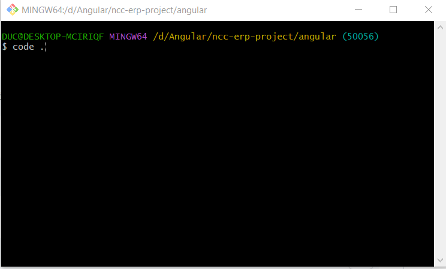

2. Install Angular CLI 9.1.15 globally:

```bash

npm install -g @angular/cli@9.1.15

```

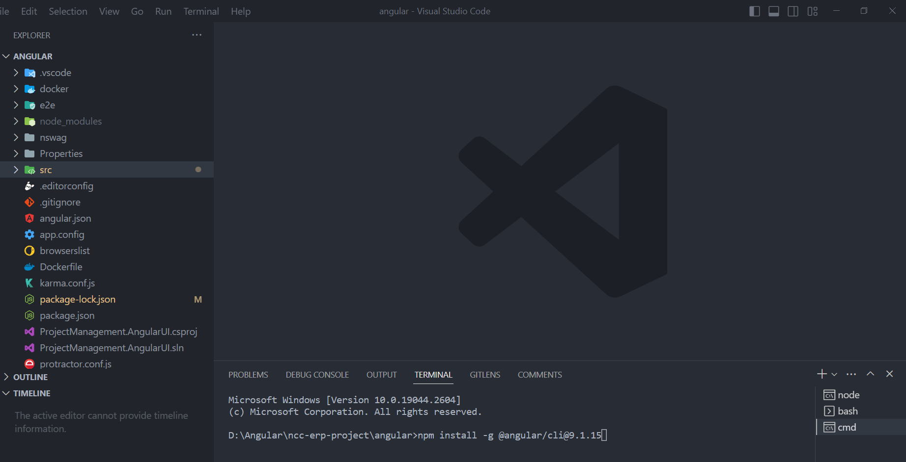

3. Install frontend dependencies:
```bash
npm install
```
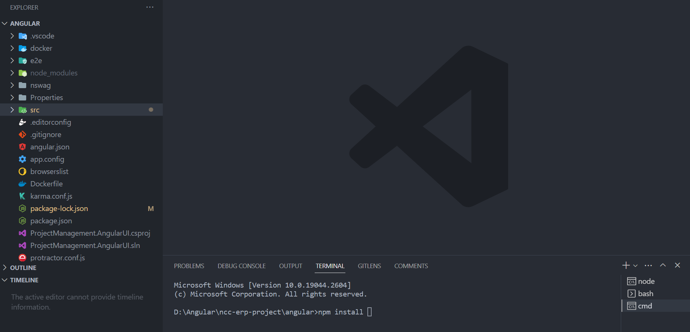
If you encounter an error while running npm install, you can use the command 
```bash 
npm install --legacy-peer-deps 
```
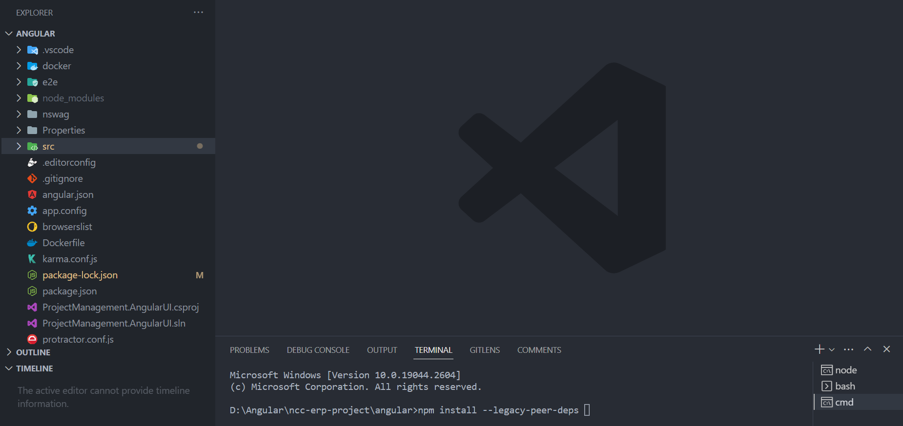
as a replacement for npm install.
The command npm install --legacy-peer-deps is used to address issues related to installing dependencies in a Node.js project when versions of the dependent packages are not compatible with each other. 

4. Run front-end
```bash
npm start
```
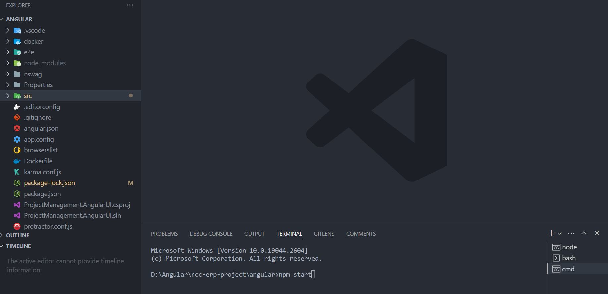

### Building
To build the project, follow these steps:

1.Build the backend using `Visual Studio Code` or the `command line`.

2.Build the frontend:

```bash
npm run build
```
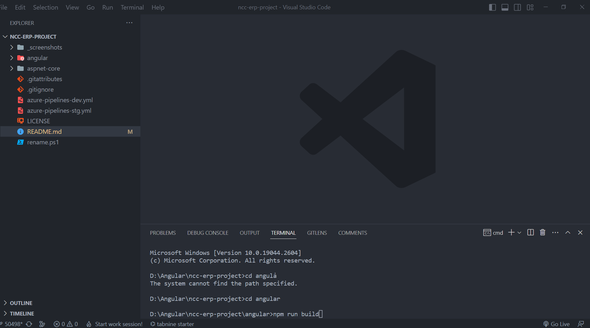
### Running
To run the project, use these commands:

1. Start the backend using `Visual Studio Code` or the `command line`.

2. Start the frontend:

```bash
npm start
```


# Screenshots

- Client page
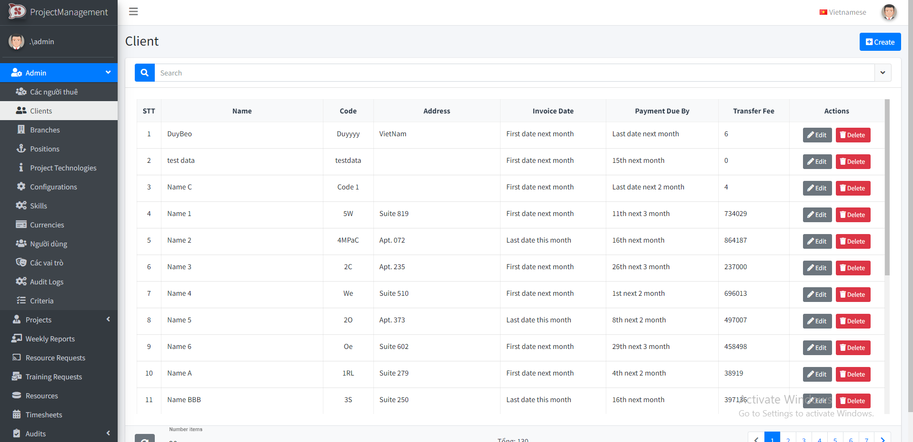

- Create a new client
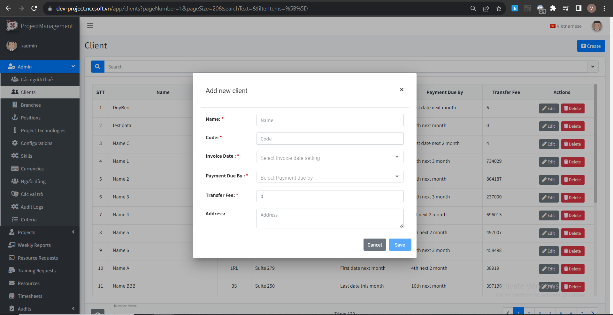

- Edit client
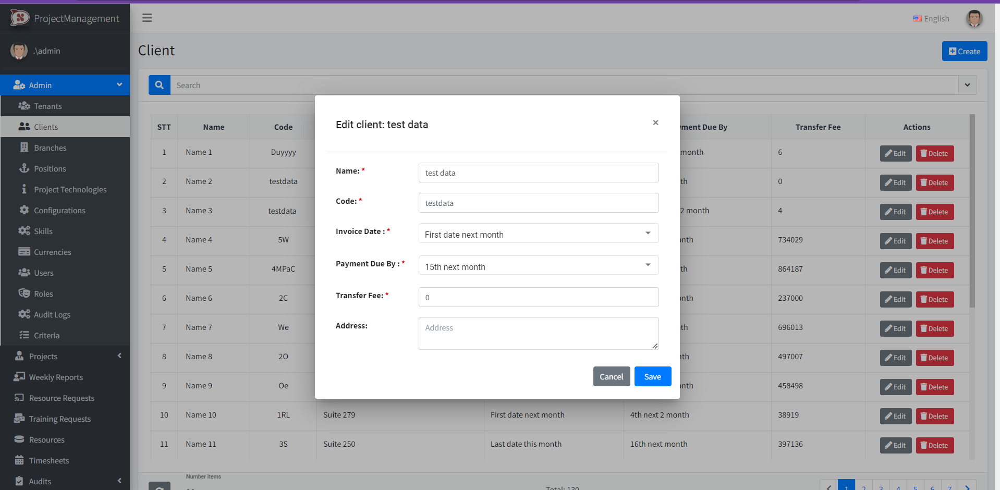

- Outsource project page
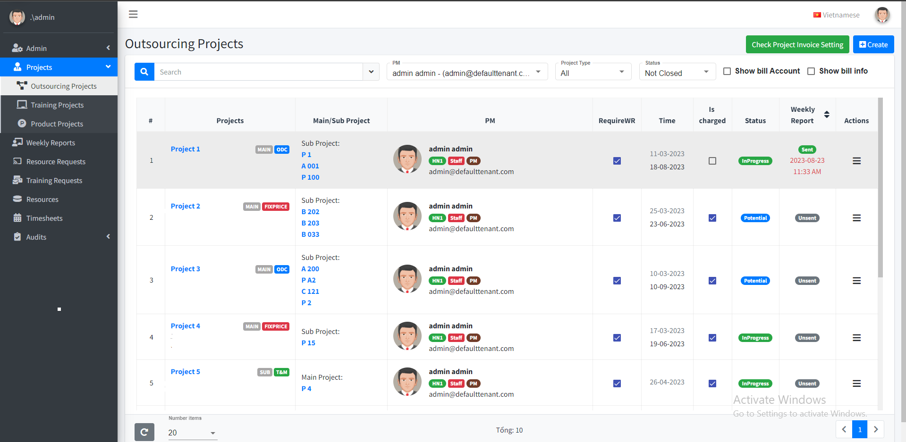

- Outsource project detail
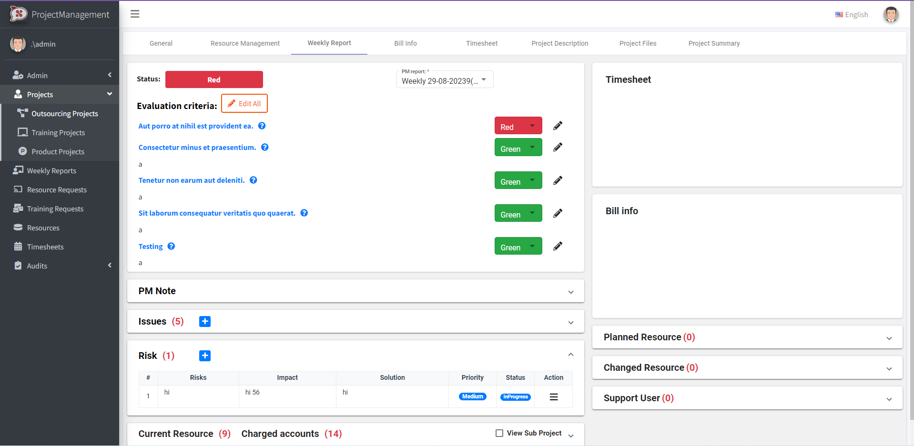

- Training project
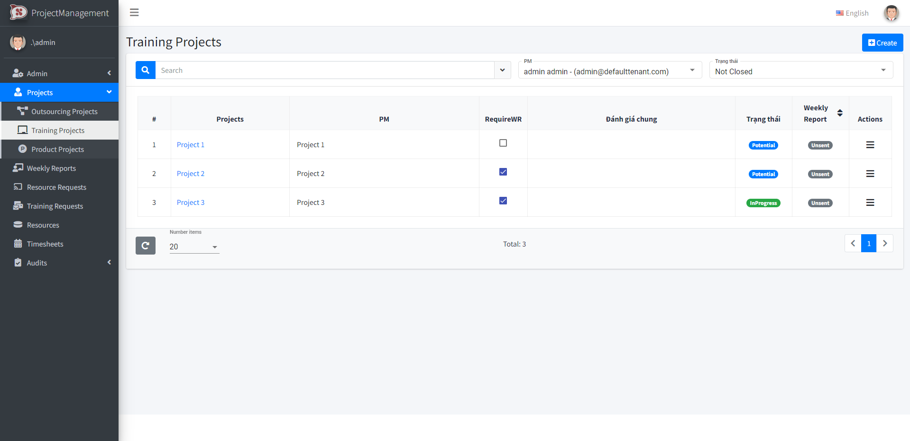

- Training project detail
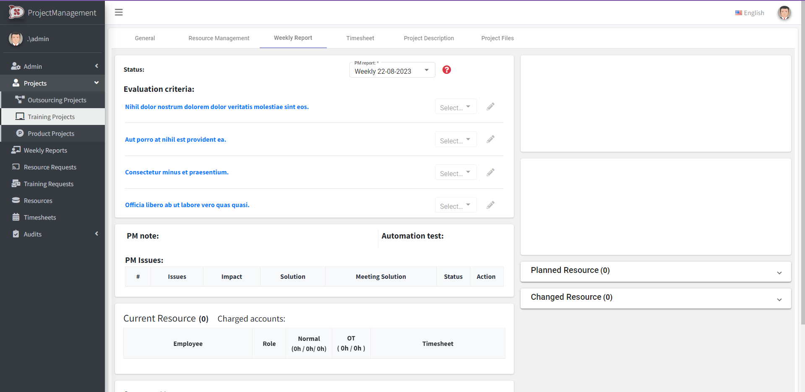

- Production project page
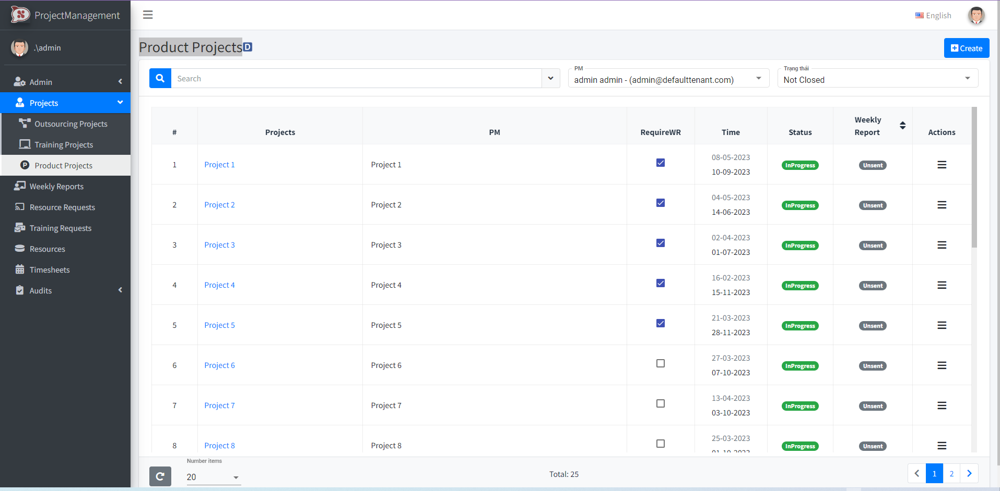

- Create product project
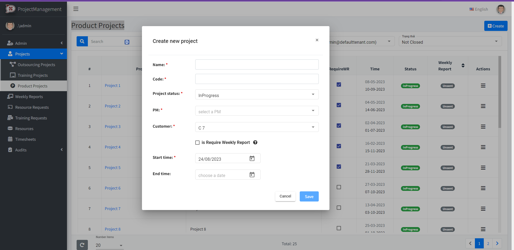

- Production project detail
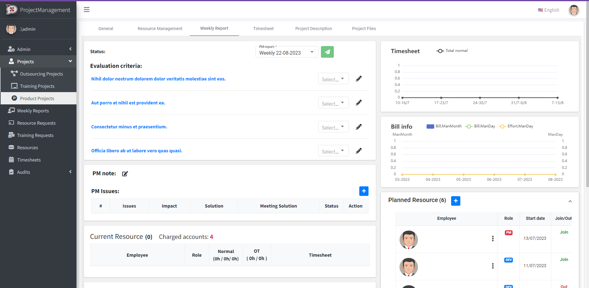

- Weekly reports page
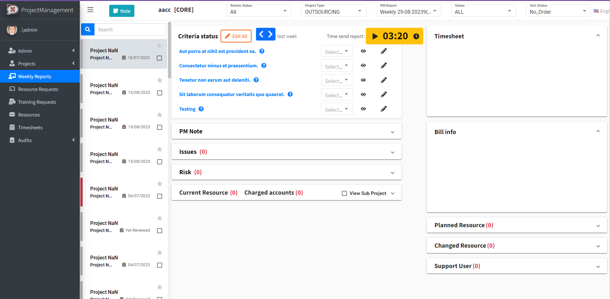


# License
[MIT](https://github.com/ncc-erp/ncc-erp-project/blob/dev/LICENSE)
